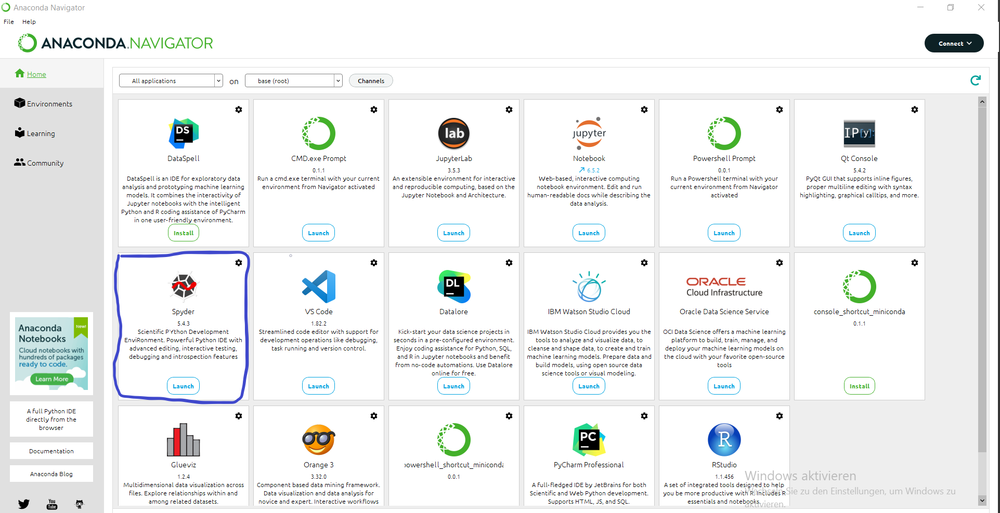
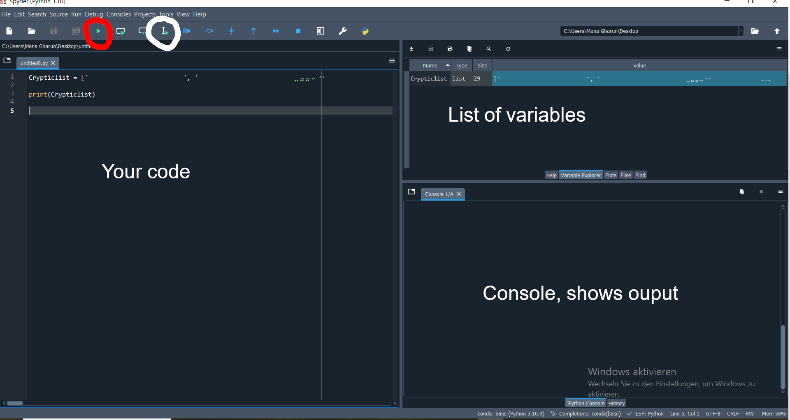

# **Installing Python**
For this course we will use a very handy tool called Anaconda. It is basically Python in a box, meaning that it creates a closed environment on your PC which already has Python and a lot of extra packages as well as additional software such as a code editor installed on it. This makes the installation as easy as it gets. The downside is that the installer is quite large (>800mb).  

To get started, just go to [Link: the Anaconda website...](https://www.anaconda.com/download){:target="_blank"}{:rel="noopener noreferrer"} and download the version for your operating system.  
  

Simply follow the download instructions and leave all the buttons as they are by default.  
  
Once the installation is finished, search for the program "Anaconda Navigator" and open it. Once it opens you are presented with the main window of your Anaconda environment  
  

In the "Home" screen you see a bunch of different programs that can run within Anaconda. The one we will use most is "Spyder" (definitely usable by people with Arachnophobia!). Make sure that Spyder is installed, if it is not click on the button to install it.  
Spyder is a code editor for Python which has some handy extensions, such as line-by-line execution and nicely viewable variables and tables during execution of code. But we will come back to that later...  

Additionally there is a window called "Environnments". Click on it and you will be presented with a table of two columns.  
   

The left side shows you environments (red box). Anaconda lets you create multiple environments (again, basically separete Python installations which are secluded from each other). This can be useful if e.g. you need functionality of very specific versions of packages for some program, but the same package in a different version in another program. To avoid the different versions clashing you can put them in different environments.  
On the right side (blue box) you can see the packages which are installed in an environment. Python has some internal core functionalities, but there are many many (many many many...) additional packages created by the community which unlock Pythons full potential. Some of the most widely used pacakges are e.g. numpy, pandas or scikit-learn. 

**Notice:** Try searching for them in the environment using the search-box on the top right and see whether they are already installed!
{: .notice}

If a package is missing and you want to install it, select the dropdown menu on the top that by default says "installed" and swithc to "Not installed". Then use the search box again to find the package you want to install. 

**Notice:** Try installing the package "xgboost" in this way.
{: .notice}

Once you have finished all of this you should be good to go! To verify that everything works go to the "Home" tab and start Spyder. Time for your first line of code!  
In the open Editor you will have to save the file in order to run it. Then copy and paste the following code by clicking the button on the top right in the box below. Insert it into spyder.  

```python
Crypticlist = ['⠀⠀⠀⠀⠀⠀⠀⠀⠀⠀⠀⠀⠀⠀⠀⠀⠀⠀⠀⠀⠀', '                          ⣀⣤⣤⠤⠐⠂⠀⠀⠀⠀⠀⠀⠀⠀⠀⠀⠀⠀⠀⠀⠀⠀⠀⠀⠀⠀⠀⠀⠀⠀⠀⠀⠀⠀⠀⠀⠀', '⠀⠀⠀⠀⠀⠀⠀⠀⠀⠀⠀⠀⠀⠀⠀⠀⠀⠀⠀⠀⡌⡦⠊⠀⠀⠀⠀⠀⠀⠀⠀⠀⠀⠀⠀⠀⠀⠀⠀⠀⠀⠀⠀⠀⠀⠀⠀⠀⠀⠀⠀⠀⠀⠀⠀⠀⠀⠀', '⠀⠀⠀⠀⠀⠀⠀⠀⠀⠀⠀⠀⠀⠀⠀⠀⠀⠀⡀⣼⡊⢀⠔⠀⠀⣄⠤⠀⠀⠀⠀⠀⠀⠀⠀⠀⠀⠀⠀⠀⠀⠀⠀⠀⠀⠀⠀⠀⠀⠀⠀⠀⣀⣤⣤⣄⣀⠀', '⠀⠀⠀⠀⠀⠀⠀⠀⠀⠀⠀⠀⠀⠀⠀⠀⠀⢠⣶⠃⠉⠡⡠⠤⠊⠀⠠⣀⣀⡠⠔⠒⠀⠀⠀⠀⠀⠀⠀⠀⠀⠀⠀⠀⠀⠀⠀⠀⠀⠀⣠⣾⣿⢟⠿⠛⠛⠁', '⠀⠀⠀⠀⠀⠀⠀⠀⠀⠀⠀⠀⠀⠀⠀⠀⠀⣼⡇⠀⠀⠀⠀⠑⠶⠖⠊⠁⠀⠀⠀⡀⠀⠀⠀⢀⣠⣤⣤⡀⠀⠀⠀⠀⠀⢀⣠⣤⣶⣿⣿⠟⡱⠁⠀⠀⠀⠀', '⠀⠀⠀⠀⠀⠀⠀⠀⠀⠀⠀⠀⠀⠀⠀⢰⣾⣿⡇⠀⢀⡠⠀⠀⠀⠈⠑⢦⣄⣀⣀⣽⣦⣤⣾⣿⠿⠿⠿⣿⡆⠀⠀⢀⠺⣿⣿⣿⣿⡿⠁⡰⠁⠀⠀⠀⠀⠀', '⠀⠀⠀⠀⠀⠀⠀⠀⠀⠀⠀⠀⠀⠀⠀⣾⣿⣿⣧⣠⠊⣠⣶⣾⣿⣿⣶⣶⣿⣿⠿⠛⢿⣿⣫⢕⡠⢥⣈⠀⠙⠀⠰⣷⣿⣿⣿⡿⠋⢀⠜⠁⠀⠀⠀⠀⠀⠀', '⠀⠀⠀⠀⠀⠀⠀⠀⠀⠀⠀⠀⠀⠀⠠⢿⣿⣿⣿⣿⣰⣿⣿⠿⣛⡛⢛⣿⣿⣟⢅⠀⠀⢿⣿⠕⢺⣿⡇⠩⠓⠂⢀⠛⠛⠋⢁⣠⠞⠁⠀⠀⠀⠀⠀⠀⠀⠀', '⠘⢶⡶⢶⣶⣦⣤⣤⣤⣤⣤⣀⣀⣀⣀⡀⠀⠘⣿⣿⣿⠟⠁⡡⣒⣬⢭⢠⠝⢿⡡⠂⠀⠈⠻⣯⣖⣒⣺⡭⠂⢀⠈⣶⣶⣾⠟⠁⠀⠀⠀⠀⠀⠀⠀⠀⠀⠀', '⠀⠀⠙⠳⣌⡛⢿⣿⣿⣿⣿⣿⣿⣿⣿⣻⣵⣨⣿⣿⡏⢀⠪⠎⠙⠿⣋⠴⡃⢸⣷⣤⣶⡾⠋⠈⠻⣶⣶⣶⣷⣶⣷⣿⣟⠁⠀⠀⠀⠀⠀⠀⠀⠀⠀⠀⠀⠀', '⠀⠀⠀⠀⠈⠛⢦⣌⡙⠛⠿⣿⣿⣿⣿⣿⣿⣿⣿⣿⡀⠀⠀⠩⠭⡭⠴⠊⢀⠀⠀⠀⠀⠀⠀⠀⠀⠈⣿⣿⣿⣿⣿⡇⠁⠀⠀⠀⠀⠀⠀⠀⠀⠀⠀⠀⠀⠀', '⠀⠀⠀⠀⠀⠀⠀⠈⠙⠓⠦⣄⡉⠛⠛⠻⢿⣿⣿⣿⣷⡀⠀⠀⠀⠀⢀⣰⠋⠀⠀⠀⠀⠀⣀⣰⠤⣳⣿⣿⣿⣿⣟⠑⠀⠀⠀⠀⠀⠀⠀⠀⠀⠀⠀⠀⠀⠀', '⠀⠀⠀⠀⠀⠀⠀⠀⠀⠀⠀⠀⠉⠓⠒⠒⠶⢺⣿⣿⣿⣿⣦⣄⣀⣴⣿⣯⣤⣔⠒⠚⣒⣉⣉⣴⣾⣿⣿⣿⣿⣿⠀⠀⠀⠀⠀⠀⠀⠀⠀⠀⠀⠀⠀⠀⠀⠀', '⠀⠀⠀⠀⠀⠀⠀⠀⠀⠀⠀⠀⠀⠀⠀⠀⠀⠛⠹⢿⣿⣿⣿⣿⣿⣿⣿⣿⣿⣿⣿⣿⣿⣿⣿⣿⣿⣿⣿⣿⣿⡇⠀⠀⠀⠀⠀⠀⠀⠀⠀⠀⠀⠀⠀⠀⠀⠀', '⠀⠀⠀⠀⠀⠀⠀⠀⠀⠀⠀⠀⠀⠀⠀⠀⠀⠀⠀⠀⠙⣿⣿⣿⣿⣿⣿⣿⣿⣿⣿⣭⣉⣉⣤⣿⣿⣿⣿⣿⣿⡿⢀⡀⠀⠀⠀⠀⠀⠀⠀⠀⠀⠀⠀⠀⠀⠀', '⠀⠀⠀⠀⠀⠀⠀⠀⠀⠀⠀⠀⠀⠀⠀⠀⠀⠀⠀⠀⣠⣿⣿⣿⣿⣿⣿⣿⣿⣿⣿⣿⣿⣿⣿⣿⣿⣿⣿⡿⠟⡁⡆⠙⢶⣀⠀⢀⣀⡀⠀⠀⠀⠀⠀⠀⠀⠀', '⠀⠀⠀⠀⠀⠀⠀⠀⠀⠀⠀⠀⠀⠀⠀⢀⣀⣴⣶⣾⣿⣟⢿⣿⣿⣿⣿⣿⣿⣿⣿⣿⣿⣿⣿⣿⠿⢛⣩⣴⣿⠇⡇⠸⡆⠙⢷⣄⠻⣿⣦⡄⠀⠀⠀⠀⠀⠀', '⠀⠀⠀⠀⠀⠀⠀⠀⠀⠀⠀⠀⠀⢀⣼⣿⣿⣿⣿⣿⣿⣿⣎⢻⣿⣿⣿⣿⣿⣿⣿⣭⣭⣭⣵⣶⣾⣿⣿⣿⠟⢰⢣⠀⠈⠀⠀⠙⢷⡎⠙⣿⣦⠀⠀⠀⠀⠀', '⠀⠀⠀⠀⠀⠀⠀⠀⠀⠀⠀⢀⣼⣿⣿⣿⣿⣿⣿⣿⣿⡟⣿⡆⢻⣿⣿⣿⣿⣿⣿⣿⣿⣿⠿⠿⠟⠛⠋⠁⢀⠇⢸⡇⠀⠀⠀⠀⠈⠁⠀⢸⣿⡆⠀⠀⠀⠀', '⠀⠀⠀⠀⠀⠀⠀⠀⠀⠀⢠⣾⣿⣿⣿⣿⣿⣿⣿⣿⣿⣿⡜⡿⡘⣿⣿⣿⣿⣿⣶⣶⣤⣤⣤⣤⣤⣤⣤⣴⡎⠖⢹⡇⠀⠀⠀⠀⠀⠀⠀⠀⣿⣷⡄⠀⠀⠀', '⠀⠀⠀⠀⠀⠀⠀⠀⠀⢀⣿⣿⣿⣿⣿⣿⣿⣿⣿⣿⣿⣿⣿⣦⡀⠘⢿⣿⣿⣿⣿⣿⣿⣿⣿⠿⠿⠛⠋⡟⠀⠀⣸⣷⣀⣤⣀⣀⣀⣤⣤⣾⣿⣿⣿⠀⠀⠀', '⠀⠀⠀⠀⠀⠀⠀⠀⠀⣸⣿⣿⣿⣿⣿⣿⣿⣿⣿⣿⣿⣿⣿⣿⣭⣓⡲⠬⢭⣙⡛⠿⣿⣿⣶⣦⣀⠀⡜⠀⠀⣰⣿⣿⣿⣿⣿⣿⣿⣿⣿⣿⣿⣿⣿⡇⠀⠀', '⠀⠀⠀⠀⠀⠀⠀⠀⢀⣿⣿⣿⣿⣿⣿⣿⣿⣿⣿⣿⣿⣿⣿⣿⣿⣿⣭⣛⣓⠶⠦⠥⣀⠙⠋⠉⠉⠻⣄⣀⣸⣿⣿⣿⣿⣿⣿⣿⣿⣿⣿⣿⣿⣿⣿⡇⠀⠀', '⠀⠀⠀⠀⠀⠀⠀⠀⣼⣿⣿⣿⣿⣿⣿⣿⣿⣿⣿⣿⣿⣿⣿⣿⣿⣿⣿⣿⣿⣿⣿⣷⣶⣆⠐⣦⣠⣷⠊⠁⠀⠀⡭⠙⣿⣿⣿⣿⣿⣿⣿⣿⣿⣿⣿⡆⠀⠀', '⠀⠀⠀⠀⠀⠀⠀⢠⣿⣿⣿⣿⣿⣿⣿⣿⣿⣿⣿⣿⣿⣿⣿⣿⣿⣿⣿⣿⣿⣿⣿⣿⣿⡿⢉⣛⡛⢻⡗⠂⠀⢀⣷⣄⠈⢆⠉⠙⠻⢿⣿⣿⣿⣿⣿⠇⠀⠀', '⠀⠀⠀⠀⠀⠀⠀⠘⣿⣿⡟⢻⣿⣿⣿⣿⣿⣿⣿⣿⣿⣿⣿⣿⣿⣿⣿⣿⣿⣿⡟⣉⢁⣴⣿⣿⣿⣾⡇⢀⣀⣼⡿⣿⣷⡌⢻⣦⡀⠀⠈⠙⠛⠿⠏⠀⠀⠀', '⠀⠀⠀⠀⠀⠀⠀⠀⠙⢿⣿⡄⠙⢿⣿⣿⣿⣿⣿⣿⣿⣿⣿⣿⣿⣿⣿⣿⠿⠛⠛⠛⢯⡉⠉⠉⠉⠉⠛⢼⣿⠿⠿⠦⡙⣿⡆⢹⣷⣤⡀⠀⠀⠀⠀⠀⠀⠀', '⠀⠀⠀⠀⠀⠀⠀⠀⠀⠀⠘⠿⠄⠈⠻⠿⠿⠿⠿⠿⠿⠛⠛⠿⠛⠉⠁⠀⠀⠀⠀⠀⠀⠻⠿⠿⠿⠿⠟⠉⠀⠀⠤⠴⠶⠌⠿⠘⠿⠿⠿⠿⠶⠤⠀']

for line in Crypticlist:
  print(line)
```

Now its time to run your first script! You can run all of your script by clicking the green arrow on top (red circle) or you can run the code line-by-line with the green arrow with the line-symbol next to it (white circle). Once you ran the code you will see the variables created in the list on the top right (see picture below) and you will
see the output of your code in the bottom right in the console (see picture below).  



 May the code be with you!
